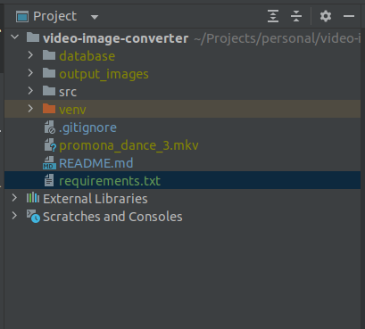
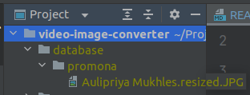

# video-image-converter

## Installation 

To run the project smoothly you need python 3.8 or above. Preferable version of python is 3.8, unless it is updated later on. 
The necessary packages will be installed by running the following command.

``` pip install -r requirements.txt ```

## Run 

This code can process one video at a time. The accepted video format is mp4 or mkv. You have to put your video inside the project directory. Create a folder called database inside the project directory.Your project directory should look like this 



Inside the database folder create folder/ folders of images of people you want to recognize. For example I only wanted to recognize one person, therefore inside the database folder I have a subdirectory called promona/ and this folder has an image of the person I want to recognize. I can also add multiple images of the same person in the same folder with varieties, the more images the better. If I wanted to recognize multiple persons from the video I would have to add folders for each person. The folder names could be anything. After adding the folder promona/, my database folder looks like this 





Now we are ready to execute the code. Just run main.py file inside the src folder. 

``` cd src/ ```

``` python main.py ```


It will generate a folder called output_images/ inside the project folder and you will the resulting images there. 

## Underlying models 

This code uses mediapipe for face detection and deepface for the face recognition. For further details on their mecchanism, please refer to the following links 

[Deep Face](https://github.com/serengil/deepface/tree/master)

[Mediapipe](https://developers.google.com/mediapipe)


